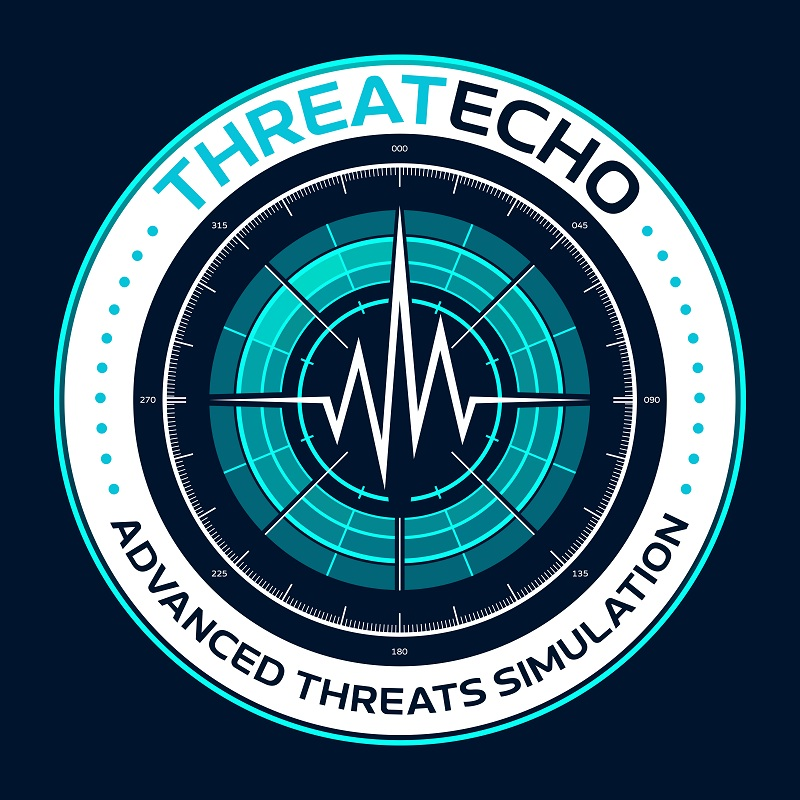

<p align="center">
  
</p>

# Policy DSL Reference

ThreatEcho's policy engine evaluates agent tool-call policies against campaign stages. Policies define which tools, tactics, and actions an AI agent is permitted to use, and under what conditions. The engine evaluates campaigns against these policies and reports violations as deny (blocked) or alert (warned).

This is the control plane for AI agent security: declare what your agents can and cannot do, then verify that adversary campaigns would be caught by your policies.

## Policy File Layout

Policies live in directories containing a `policy.yaml` file:

```
policies/
└── agent-default/
    └── policy.yaml
```

## Policy YAML Schema

```yaml
api_version: v1           # Required. Always "v1".
kind: Policy               # Required. Always "Policy".
meta: { ... }              # Required. Policy metadata.
agent: { ... }             # Required. Which agent this policy applies to.
rules: [ ... ]             # Required. At least one rule.
```

## Meta Block

| Field | Type | Required | Description |
|-------|------|----------|-------------|
| `name` | string | Yes | Policy identifier. Shown in reports. |
| `description` | string | No | What this policy enforces. |
| `authors` | list of strings | No | Policy authors. |
| `created` | string | No | ISO date. |
| `modified` | string | No | ISO date. |

```yaml
meta:
  name: agent-default
  description: >
    Default security policy for AI agent tool-call enforcement.
    Blocks dangerous operations unless explicitly allowed.
  authors: ["ThreatEcho"]
  created: "2026-09-14"
  modified: "2026-09-14"
```

## Agent Block

The `agent` block scopes which agent this policy applies to.

| Field | Type | Required | Description |
|-------|------|----------|-------------|
| `name` | string | Yes | Agent name or `"*"` for all agents. |
| `type` | string | No | Agent type: `llm`, `retrieval`, `orchestrator`. |
| `tools` | list of strings | No | Tools the agent can call. Documentation for the policy scope. |

```yaml
agent:
  name: "*"
  type: llm
  tools:
    - shell_exec
    - http_request
    - send_email
    - tool_call
    - search_knowledge_base
    - write_knowledge_base
    - agent_message
```

The `tools` list documents the agent's capabilities. It does not restrict evaluation; rules match against tools inferred from campaign stages, not this list.

## Rule Structure

Each rule defines a condition under which a stage is denied, allowed, or alerted.

| Field | Type | Required | Description |
|-------|------|----------|-------------|
| `id` | string | Yes | Unique rule identifier. Must not duplicate another rule's ID. |
| `description` | string | No | What this rule enforces. Shown in violation reports. |
| `effect` | string | Yes | `deny`, `allow`, or `alert`. |
| `priority` | int | Yes | Higher number = evaluated first. First match wins. |
| `match` | object | Yes | What this rule matches against. At least one dimension required. |
| `conditions` | list of objects | No | Additional constraints that must pass for the rule to fire. |

```yaml
rules:
  - id: deny-shell-exec
    description: Block all shell command execution by agents
    effect: deny
    priority: 100
    match:
      tools: ["shell_exec"]
```

## Effects

| Effect | Behavior | Exit Code | Report Symbol |
|--------|----------|-----------|---------------|
| `deny` | Block the stage. The campaign fails policy evaluation. | 2 | `✗` (red) |
| `allow` | Explicitly permit the stage. No violation recorded. | 0 | `✓` (green) |
| `alert` | Warn about the stage but allow it to proceed. | 0 | `⚠` (yellow) |

Exit code 2 on `deny` makes policy evaluation CI-friendly. Any denied stage causes the process to exit with code 2, which CI pipelines treat as a failure.

### Verdict Logic

| Condition | Verdict | Exit Code |
|-----------|---------|-----------|
| Any stage denied | `FAIL` | 2 |
| No denies, at least one alert | `WARN` | 0 |
| All stages allowed | `PASS` | 0 |

## Priority System

Rules are sorted by `priority` in descending order (highest first) before evaluation. The **first matching rule wins** for each stage. This means:

- **Higher priority rules take precedence.** A deny at priority 100 overrides an allow at priority 10.
- **Unmatched stages get implicit allow.** If no rule matches a stage, it is implicitly allowed.
- **Use priority tiers to structure your policy.** Example: deny rules at 90-100, alert rules at 50, allow rules at 10.

```
Priority 100:  deny-shell-exec          ← Evaluated first
Priority 95:   deny-c2-domains
Priority 90:   deny-kb-write
Priority 50:   alert-exfiltration        ← Evaluated after all denies
Priority 10:   allow-http-read           ← Evaluated last
               (implicit allow)          ← Fallback if nothing matches
```

## Match Block

The `match` block defines what a rule applies to. At least one dimension must be specified. When multiple dimensions are specified, **all specified dimensions must match** (AND across dimensions). Within each dimension, **any entry matching is sufficient** (OR within dimension).

| Field | Type | Description |
|-------|------|-------------|
| `tools` | list of strings | Tool name patterns (glob). Matched against inferred tools from stage. |
| `tactics` | list of strings | Tactic short names. Exact match against stage tactic. |
| `actions` | list of strings | Action categories. Exact match against inferred actions. |
| `targets` | list of strings | Target URL/host patterns (glob). Matched against `execute.target`. |

### Tool Inference

Campaign stages don't declare tools directly. ThreatEcho infers tools from two sources:

**From `execute.type`:**

| Execute Type | Inferred Tool |
|-------------|---------------|
| `shell` | `shell_exec` |
| `powershell` | `shell_exec` |
| `http` | `http_request` |
| `dns` | `dns_query` |
| `file` | `file_access` |
| `registry` | `registry_access` |
| `service` | `service_control` |
| `process` | `process_exec` |
| `manual` | _(none)_ |

Stages with `execute.type: manual` have no tool or action inference. They receive implicit allow from the policy engine unless matched by technique or tactic rules.

**From `expect.telemetry`:**

| Telemetry Type | Inferred Tool |
|---------------|---------------|
| `tool_call` | `tool_call` |
| `email_sent` | `send_email` |
| `embedding_query` | `search_knowledge_base` |
| `vector_store_write` | `write_knowledge_base` |
| `inter_agent_message` | `agent_message` |

A single stage can infer multiple tools (one from execute type, zero or more from telemetry).

### Action Inference

Actions are inferred from `execute.type`:

| Execute Type | Inferred Action |
|-------------|----------------|
| `shell` | `execute` |
| `powershell` | `execute` |
| `http` | `send` |
| `dns` | `query` |
| `file` | `write` |
| `registry` | `write` |
| `service` | `execute` |
| `process` | `execute` |

### Glob Matching

Tool and target patterns support `*` as a wildcard matching any sequence of characters.

```yaml
# Match any tool
tools: ["*"]

# Match all _exec tools
tools: ["*_exec"]

# Match specific C2 domain patterns
targets: ["https://*.evil.com/*", "http://*:4444/*"]
```

The glob engine handles both simple name patterns (via `path.Match`) and URL-like strings with wildcards (custom prefix/suffix matching).

### Match Examples

```yaml
# Match a specific tool
match:
  tools: ["shell_exec"]

# Match a tactic
match:
  tactics: ["exfiltration"]

# Match a tool AND a tactic (both must match)
match:
  tools: ["http_request"]
  tactics: ["exfiltration"]

# Match targets by URL pattern
match:
  targets: ["https://*.evil.com/*"]

# Match an action category
match:
  actions: ["execute"]
```

## Conditions

Conditions add constraints beyond the match block. All conditions must pass (AND) for the rule to fire.

| Field | Type | Description |
|-------|------|-------------|
| `field` | string | Stage field to test. |
| `operator` | string | Comparison operator. |
| `value` | string | Value to compare against. |

### Available Fields

| Field | Description | Value |
|-------|-------------|-------|
| `elevated` | Whether the stage requires elevated privileges | `"true"` or `"false"` |
| `technique` | Stage technique ID | e.g., `"T1059.001"`, `"AML.T0051"` |
| `tactic` | Stage tactic short name | e.g., `"execution"`, `"ml-model-access"` |
| `platform` | Stage platform list (comma-joined) | e.g., `"windows"`, `"linux,macos"` |
| `exec_type` | Stage execute type | e.g., `"shell"`, `"http"` |

### Operators

| Operator | Description | Example |
|----------|-------------|---------|
| `eq` | Exact equality | `field: elevated, operator: eq, value: "true"` |
| `ne` | Not equal | `field: exec_type, operator: ne, value: "http"` |
| `in` | Value is in comma-separated list | `field: tactic, operator: in, value: "execution,impact"` |
| `not_in` | Value is not in comma-separated list | `field: platform, operator: not_in, value: "windows"` |
| `matches` | Glob pattern match (uses `path.Match`) | `field: technique, operator: matches, value: "T1059.*"` |

### Condition Example

```yaml
# Block elevated execution only
- id: deny-elevated
  description: Block any stage requiring root/admin privileges
  effect: deny
  priority: 100
  match:
    actions: ["execute"]
  conditions:
    - field: elevated
      operator: eq
      value: "true"
```

## Evaluation Flow

```
For each campaign stage (in stage order):
  │
  ├── Infer tools from execute.type + expect.telemetry
  ├── Infer actions from execute.type
  ├── Get target from execute.target
  │
  └── For each rule (sorted by priority, descending):
       │
       ├── Check match dimensions (AND across, OR within):
       │   ├── tools specified? → at least one must glob-match
       │   ├── tactics specified? → stage tactic must match
       │   ├── actions specified? → at least one must match
       │   └── targets specified? → target must glob-match
       │
       ├── Check conditions (all must pass):
       │   └── field + operator + value against stage data
       │
       ├── First matching rule wins:
       │   ├── deny  → record violation, increment denied count
       │   ├── alert → record violation, increment alerted count
       │   └── allow → increment allowed count
       │
       └── No rule matches → implicit allow
```

## Built-in Policy: agent-default

The `agent-default` policy ships with ThreatEcho in `policies/agent-default/policy.yaml`. It provides a balanced security posture for AI agents.

### Deny Rules (Priority 90-100)

| Rule ID | Description | Match |
|---------|-------------|-------|
| `deny-shell-exec` | Block all shell execution | tools: `shell_exec` |
| `deny-elevated-exec` | Block elevated/root operations | actions: `execute` + condition: `elevated=true` |
| `deny-kb-write` | Block knowledge base writes (RAG poisoning vector) | tools: `write_knowledge_base` |
| `deny-agent-lateral` | Block agent-to-agent messages (lateral movement) | tools: `agent_message` |
| `deny-c2-domains` | Block known C2 patterns | targets: `*.evil.com/*`, `*.c2.*/*`, `*:4444/*` |

### Alert Rules (Priority 50)

| Rule ID | Description | Match |
|---------|-------------|-------|
| `alert-exfiltration` | Alert on exfiltration tactic stages | tactics: `exfiltration` |
| `alert-email-send` | Alert on email sending (exfil channel) | tools: `send_email` |
| `alert-credential-access` | Alert on credential access tactic | tactics: `credential-access` |

### Allow Rules (Priority 10)

| Rule ID | Description | Match |
|---------|-------------|-------|
| `allow-http-read` | Allow HTTP requests to non-blocked targets | tools: `http_request` + condition: `exec_type=http` |
| `allow-kb-search` | Allow read-only knowledge base searches | tools: `search_knowledge_base` |

## Writing Custom Policies

### Zero-Trust Policy (Deny by Default)

```yaml
api_version: v1
kind: Policy

meta:
  name: agent-strict
  description: "Zero-trust policy — deny everything except explicitly allowed tools"

agent:
  name: "*"
  type: llm

rules:
  # Explicit allows at low priority
  - id: allow-kb-search
    description: Allow knowledge base searches
    effect: allow
    priority: 10
    match:
      tools: ["search_knowledge_base"]

  - id: allow-http-get
    description: Allow HTTP requests to internal APIs
    effect: allow
    priority: 10
    match:
      tools: ["http_request"]
    conditions:
      - field: exec_type
        operator: eq
        value: "http"

  # Deny everything else at high priority
  - id: deny-all
    description: Default deny — block everything not explicitly allowed
    effect: deny
    priority: 1
    match:
      tools: ["*"]
```

### Tactic-Based Policy

```yaml
api_version: v1
kind: Policy

meta:
  name: soc-baseline
  description: "Alert on high-risk tactics, deny known-bad patterns"

agent:
  name: "*"

rules:
  - id: deny-impact
    description: Block all impact-tactic stages
    effect: deny
    priority: 100
    match:
      tactics: ["impact"]

  - id: alert-high-risk
    description: Alert on high-risk tactics
    effect: alert
    priority: 50
    match:
      tactics: ["initial-access", "execution", "exfiltration", "credential-access"]

  - id: allow-recon
    description: Allow reconnaissance stages
    effect: allow
    priority: 10
    match:
      tactics: ["reconnaissance", "discovery"]
```

### Technique-Scoped Policy

```yaml
rules:
  - id: deny-lsass-dump
    description: Block LSASS credential dumping
    effect: deny
    priority: 100
    match:
      tools: ["*"]
    conditions:
      - field: technique
        operator: eq
        value: "T1003.001"

  - id: deny-prompt-injection
    description: Block prompt injection techniques
    effect: deny
    priority: 100
    match:
      tools: ["*"]
    conditions:
      - field: technique
        operator: eq
        value: "AML.T0051"
```

## CLI Usage

### Validate a Policy

```bash
threatecho policy validate policies/agent-default/
# ✓ Policy "agent-default" is valid (10 rules, agent: *)
```

### Evaluate Against Campaigns

```bash
# Single campaign
threatecho policy eval -policy policies/agent-default/ campaigns/llm-agent-hijack/

# All campaigns in a directory
threatecho policy eval -policy policies/agent-default/ -dir campaigns/
```

### Output Formats

```bash
# Text (default) — ANSI report with verdict
threatecho policy eval -policy policies/agent-default/ campaigns/llm-agent-hijack/

# JSON — machine-readable with verdict field (pass/warn/fail)
threatecho policy eval -policy policies/agent-default/ -format json campaigns/llm-agent-hijack/

# SARIF — GitHub Code Scanning integration
threatecho policy eval -policy policies/agent-default/ -format sarif campaigns/llm-agent-hijack/ > policy.sarif

# JUnit — CI test reporter integration
threatecho policy eval -policy policies/agent-default/ -format junit campaigns/llm-agent-hijack/ > policy.xml
```

## CI Integration

### Exit Codes

| Code | Meaning |
|------|---------|
| 0 | All stages allowed (PASS) or only alerts (WARN) |
| 1 | Error (invalid policy, missing campaign, etc.) |
| 2 | At least one stage denied (FAIL) |

### GitHub Actions Example

```yaml
- name: Policy evaluation (SARIF)
  run: |
    ./bin/threatecho policy eval \
      -policy policies/agent-default/ \
      -format sarif \
      -dir campaigns/ > policy.sarif || true

- name: Upload SARIF to Code Scanning
  uses: github/codeql-action/upload-sarif@v3
  with:
    sarif_file: policy.sarif
    category: policy-evaluation

- name: Policy evaluation (JUnit)
  run: |
    ./bin/threatecho policy eval \
      -policy policies/agent-default/ \
      -format junit \
      -dir campaigns/ > policy.xml || true

- name: Upload JUnit test report
  uses: dorny/test-reporter@v1
  with:
    name: Policy Evaluation Results
    path: policy.xml
    reporter: java-junit
```

The `|| true` prevents the job from failing on exit code 2 so that SARIF/JUnit results are uploaded. To fail the job on policy violations, remove `|| true`.

### SARIF Rule Mapping

Policy violations map to SARIF rules dynamically. Each unique rule ID from violations becomes a SARIF rule. Effects map to SARIF levels:

| Effect | SARIF Level |
|--------|-------------|
| `deny` | `error` |
| `alert` | `warning` |

Violations include properties: `stage_id`, `technique`, `tactic`, `tool`, `effect`.

### JUnit Mapping

Policy evaluation maps to JUnit XML as:

- Suite name: `threatecho-policy-eval`
- Test count: total campaign stages
- Each violation is a failing test case with:
  - Name: stage name
  - Class: campaign name
  - Failure type: effect (`deny` or `alert`)
  - Failure message: `[DENY] rule rule-id: description`
